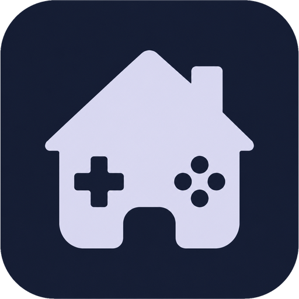
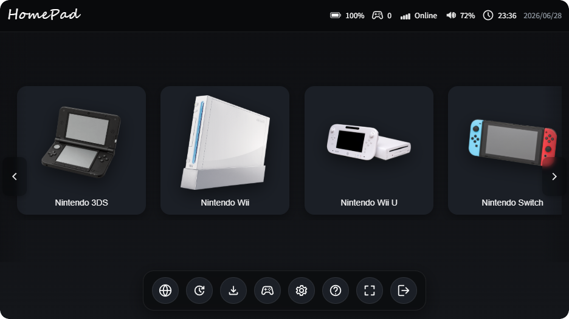

<div align="center">



# HomePad

**A console-style launcher for Nintendo emulators.**

A frameless, controller-friendly dashboard to launch, download, and set up
emulators for the DS, DSi, 3DS, Wii, Wii U, and Switch — all from one place.




</div>

---

## ✨ Features

### 🎛️ Home & launching
- **Console dashboard** — a clean, horizontally-scrolling tile grid for every system, launch on click.
- **Two launch modes** — start the emulator directly, or boot straight into the console's **Home Menu / system menu**.
- **Right-click menu** — per-tile actions to launch the Home Menu or emulator, and open the emulator / NAND / MLC folders.
- **Console mode** — a fullscreen, gamepad-navigable layout with on-screen hints; focus is trapped to the active screen so input never leaks to the background.
- **Opening screen** — a branded splash while the app boots.

### 📥 Downloader & installer
- **Built-in downloader** — fetch the latest emulator releases per system, with live progress and cancel.
- **Installer tab** — set up the harder consoles in a couple of clicks:
  - **Nintendo Switch** — install system **firmware** (NCA folder) and **decryption keys** (`prod.keys` / `title.keys`) into the emulator's data folder.
  - **Nintendo 3DS** — install **system files** (`aes_keys.txt`, `seeddb.bin`, `shared_font.bin`) into the emulator's `sysdata` folder.
  - Data folders are **auto-detected** (portable `user/` next to the emulator, then `%APPDATA%`), with a rotating *find* button when several exist, plus live **status chips** showing what's already installed.

### 🧩 Per-system setup
- **Per-system emulator folders** — point each console at its emulator, with console icons and live **path validation** (missing paths are flagged in red).
- **melonDS (DS / DSi)** — manage BIOS, firmware, and NAND paths, written straight into melonDS's config.
- **3DS NAND** & **Cemu (Wii U) MLC** — dedicated cards that show the resolved path, and a **Home System status**: whether the Home Menu file exists, plus its detected **region** and **title ID**.

### 🎮 Controllers & status
- **Controller support** — detect connected gamepads with a player indicator and a vibration test; full gamepad navigation in console mode.
- **Live status bar** — battery, Wi‑Fi, volume, and clock.

### 🎨 Polish & extras
- **Themes** — dark, light, and black, with optional **per-console icon colors** (white / black).
- **Discord Rich Presence** — shows the system you're browsing or playing, with a link to the latest release.
- **System tray** support.
- **Update checker** — the toolbar checks GitHub for the latest release and shows a clear "update available" dialog with release notes.

## 🕹️ Supported systems

| System | Emulators |
|--------|-----------|
| Nintendo DS / DSi | melonDS |
| Nintendo 3DS | Borked3DS, Azahar |
| Nintendo Wii | Dolphin |
| Nintendo Wii U | Cemu |
| Nintendo Switch | Eden, Citron, Sudachi, Suyu |

## 🚀 Getting started

Grab the latest **installer** or **portable** build from the
[Releases page](https://github.com/Riyoway/HomePad/releases), or build it yourself.

**Prerequisites:** [Node.js](https://nodejs.org), [Rust](https://www.rust-lang.org/tools/install),
and the [Tauri prerequisites](https://v2.tauri.app/start/prerequisites/). Windows is the primary target.

```bash
npm install
npm run tauri dev      # run in development
npm run tauri build    # build a release installer + portable exe
```

## 🛠️ Built with

[Tauri 2](https://tauri.app) (Rust) + TypeScript and [Vite](https://vite.dev).

## ⚠️ Disclaimer

HomePad is an independent launcher and is not affiliated with or endorsed by Nintendo or any other
company. It does not include or distribute any emulators, games, BIOS, firmware, or keys — use them
only where you have the legal right to do so. All trademarks belong to their respective owners.
